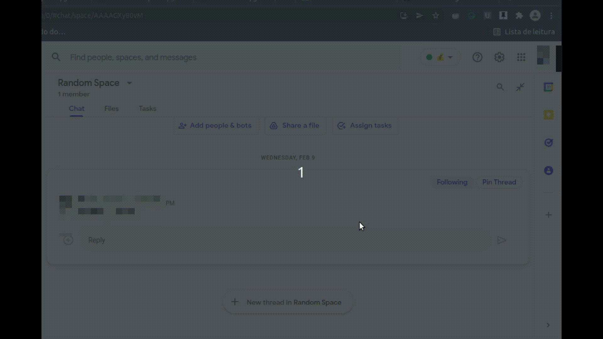

# Google Chat Pin Threads
An extension to add a button to pin thread for every thread on Google chat. After Click on the Button is possible to see the pinned thread in the extension window.

## Install from Chrome Web Store

Visit the extension page at [this link](https://chrome.google.com/webstore/detail/gchat-pin-threads/indkckjhobpnbgkjbppehhihfpdmcjon) and click on Add to chrome

## Installation from source

1. Download "Source code (zip)" of the latest version in [Releases](https://github.com/LASalvador/gchat-pin/releases) Or clone git@github.com:LASalvador/gchat-pin.git if you are comfortable with Git
2. If you downloaded the source code from Releases Unzip the downloaded zip file
3. In Chrome, go to 'Settings > Extensions'
4. Enable 'Developer mode'
5. Click on 'Load unpacked extension...' and select the folder that you unzipped

